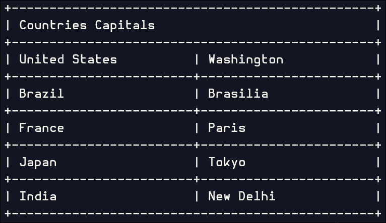

## Table of contents
- [Getting Started](#getting-started)
    - [Installation](#installation)
    - [Basic Usage](#basic-usage)
    - [Result](#result)
- [The width system](#the-width-system)
- [Rendering the table](#rendering-the-table)
- [Accessing Table Elements](#accessing-table-elements)
    - [Accessing Rows](#accessing-rows)
    - [Accessing Columns](#accessing-columns)
    - [Direct Element Access](#direct-element-access)
- [Configuration](#configuration)
    - [Available configuration functions](#available-configuration-functions)
    - [Example](#example)
- [Styling](#styling)
    - [Available Styling Options](#available-styling-options)
    - [Text attributes](#text-attributes)
    - [Color options](#color-options)
    - [Example](#example-1)
- [Border](#border)
    - [Pre-defined templates](#pre-defined-templates)
        - [Default](#default)
        - [Modern](#modern)
        - [Double](#double)
        - [Rounded](#rounded)
        - [Heavy](#heavy)
    - [Border parts](#border-parts)
- [Unicode characters support](#unicode-characters-support)

## Getting Started
### Installation
Install using cmake or directly include the [header files](../include/tabular)
or the [single-include](../single_include/tabular/tabular.h)

### Basic Usage
Create a table by making a `Table` object and add rows using `addRow()`

```c++
Table table;

table.addRow({"Countries Capitals"})
     .addRow({"United States", "Washington"})
     .addRow({"Brazil", "Brasilia"})
     .addRow({"France", "Paris"})
     .addRow({"Japan", "Tokyo"})
     .addRow({"India", "New Delhi"});
```

## The width system
By default, the width of a fresh constructed `Table` instance will be 50
you can change it using `table.config().width(size_t)` function which forces
the table to match the specified width.

To set the width of **SOME** columns **(NOT ALL OF THEM)**, the sum of their widths
MUST NOT exceed the total width of the table, and must leave **ENOUGH** space for
the other columns.

But to set the width of **ALL** the columns the sum of their widths **MUST** be exactly
equal to the width of the table minus the space preserved for the vertical borders.

If you explicitly specify a width that is less than the minimal width, a `std::runtime_exception`
will be thrown with a message containing the estimated minimum width.

for a typical example of how this works, check [this example](../examples/tasks.cpp)

## Rendering the table
To convert the table into it's string form, you can use `table.str()`, and to render it in a cross-platform way,
especially if it contains multibyte characters, it's recommended to use `render(const std::string&, FILE*)`
from `render.h`.

```c++
render(table.str() + '\n', stdout);
// or
std::cout << table.str() << '\n'; // for ascii characters
```

### Result


## Accessing Table Elements
### Accessing Rows
You can access a specific row in a table using `[]` operator or `rows()`.

```c++
Table table;
table.addRow({"Header"});

Row header = table[0];
Row header = table.rows()[0];
```

### Accessing Columns
You can access a specific column in a row using `[]` operator or `columns()`.

```c++
Row row({"Header"});

Column first = row[0]:
Column first = row.columns()[0];
```

### Direct Element Access
you can chain the operators to access a specific column directly from a table

```c++
Table table;
table.addRow({"Header"});

Column first = table[0][0];
Column first = table.rows()[0].columns()[0];
```

## Configuration
You can configure a table, row and column using `config()`

```c++
table.config().fn(params);
column.config().fn(params);
row.config().fn(params);
```

### Available configuration functions
for the `Table` class

| function  | description           | params   | default            |
|-----------|-----------------------|----------|--------------------|
| `width()` | set the table's width | `size_t` | DEFAULT_WIDTH = 50 |

for the `Row` class

| function      | description                                             | params         | default |
|---------------|---------------------------------------------------------|----------------|---------|
| `hasBottom()` | whether it has a bottom border or not                   | `bool`         | `true`  |
| `vertical()`  | vertical border (will be override by the `Table` class) | `Border::Part` | `\0`    |

for the `Column` class

| Function                | Description                               | Parameters                                        | default       |
|-------------------------|-------------------------------------------|---------------------------------------------------|---------------|
| `align()`               | text alignment                            | `Align::left` \| `Align::center` \|`Align::right` | `Align::left` |
| `width()`               | column width                              | `size_t`                                          | `0`           |
| `padd()`                | column content  padding                   | `Padd`                                            | `Padd()`      |
| `delimiter()`           | delimiter for word wrapping               | `std::string`                                     | `"-"`         |
| `skipEmptyLineIndent()` | skip spaces at the start of a line or not | `bool`                                            | `true`        |

### Example
```c++
Table table;
table.addRow({"Header"});

table[0][0].config().align(Align::Center);
table[0][0].config().width(10);
table[0][0].config().padd(Padd(1, 1));

table.config().width(60);
```

## Styling
You can style each column using `style()`

```cpp
columns.style().fn(params);
```

### Available Styling Options
| Function                    | Description                | Parameters                                                      |
|-----------------------------|----------------------------|-----------------------------------------------------------------|
| `fg()`                      | text foreground color      | `Color` or `Rgb`                                                |
| `bg()`                      | text background color      | `Color` or `Rgb`                                                |
| `base()`                    | column base color          | `Color` or `Rgb`                                                |
| `attrs()`                   | text attributes            | `Attribute` or `const Style&` (for chaining with `\|` operator) |

### Text attributes
Available text attributes
- `Attr::Bold`
- `Attr::Dim` 
- `Attr::Italic` 
- `Attr::Underline` 
- `Attr::Dunderline` double underline, not popular 
- `Attr::Blink`
- `Attr::Flink` fast blink, very rare
- `Attr::Reverse`
- `Attr::Concealed`
- `Attr::Crossed`

> [!NOTE]
> Text attributes depend on your terminal emulator and whether it supports them.

### Color options
Use either predefined terminal colors or `Rgb` colors

```c++
table[0][0].style().fg(Color::BrightRed);
table[0][0].style().fg(Rgb {255, 0, 0});
```

### Example
```c++
Table table;
table.addRow({"Product", "Price", "Status"})
     .addRow({"Laptop", "$999", "Available"});

// header row
table[0][0].style().attrs(Attribute::Bold)
                   .fg(Color::Blue);

// price column with green background
table[1][1].style().fg(Color::Black)
                   .bg(Color::Green)
                   .attrs(Attribute::Bold);

// Multiple attributes
table[0][2].style().attrs({Attribute::Bold | Attribute::Underline});
```

## Border
### Pre-defined templates
You can set a pre-defined border template using

```c++
table.border(Border::Rounded());
```

#### Default


#### Modern


#### Double


#### Rounded


#### Heavy


### Border parts
you can customize individual border parts using

```c++
Border border;

// set the glyph
border.horizontal('=');
// or
border.horizontal().glyph('=');

// set the foregroung color
border.horizontal().fg(Color::Red);
// or
border.horizontal().fg(Rgb {255, 0, 0});

// set the backgroung color
border.horizontal().bg(Color::Green);
// or
border.horizontal().bg(Rgb {0, 255, 0});
```

## Unicode characters support
By default, the library handles multibyte characters and nested ANSI escape sequences to ensure the table layout
won't break when it is displayed in a terminal.
**HOWEVER,** some terminal emulators may render certain multibyte characters (especially CJK characters)
differently than the library expects, which breaks the table's layout.
This typically happens because the library relies on some data extracted from Unicode 16, while those emulators
may use the system locale or other Unicode versions to decide the display width of those characters.
