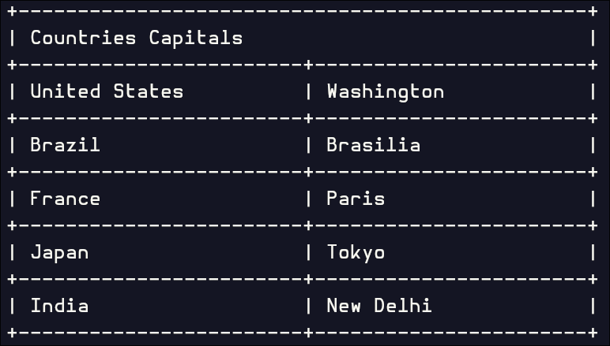
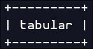

# tabular Documentation
Complete guide for using tabular, a lightweight, header-only C++ library
for creating well-formatted, fully-customizable CLI tables.

> [!WARNING]
> the project got rewrited and both the README and the documentation are still outdated.
> please don't rely on them until they get updated.

- [Getting Started](#getting-started)
  - [Installation](#installation)
  - [Namespace](#namespace)
- [Basic Usage](#basic-usage)
  - [Creating Your First Table](#creating-your-first-table)
  - [Setting Table Width](#setting-table-width)
  - [Printing Tables](#printing-tables)
- [Accessing Table Elements](#accessing-table-elements)
  - [Accessing Rows](#accessing-rows)
  - [Accessing Columns](#accessing-columns)
  - [Direct Element Access](#direct-element-access)
- [Configuration](#configuration)
  - [Available Configuration Options](#available-configuration-options)
  - [Configuration Examples](#configuration-examples)
- [Styling](#styling)
  - [Available Styling Options](#available-styling-options)
  - [Text Attributes](#text-attributes)
  - [Color Options](#color-options)
  - [Styling Examples](#styling-examples)
- [Border Control](#border-control)
  - [Border Styles](#border-styles)
  - [Available Border Styles](#available-border-styles)
  - [Custom Border Parts](#custom-border-parts)
  - [Border Colors](#border-colors)
- [Multi-byte Character Support](#multi-byte-character-support)
  - [Enabling Multi-byte Support](#enabling-multi-byte-support)
  - [When to Use](#when-to-use)
  - [Example](#example)
- [Advanced Examples](#advanced-examples)
  - [Styled Financial Report](#styled-financial-report)

## Getting Started

### Installation
Include the single header file or the modular include in your project:

```cpp
#include "tabular.hpp"
```

### Namespace
For convenience, we will be using the tabular namespace:

```cpp
using namespace tabular;
```

## Basic Usage

### Creating Your First Table
Create a table by defining a `Table` variable and adding rows using `add_row()`:

```cpp
Table table;

table.add_row({"Country", "Capital"})
     .add_row({"United States", "Washington"})
     .add_row({"Brazil", "Brasilia"})
     .add_row({"France", "Paris"})
     .add_row({"Japan", "Tokyo"})
     .add_row({"India", "New Delhi"});
```

### Setting Table Width
You can set the total table width using:

```cpp
table.set().width(50);
```

### Printing Tables
You have three options for outputting your table:

```cpp
// Option 1: Print directly to stdout
print(table);

// Option 2: Specify a standard stream
print(table, STD::OUT);    // stdout
print(table, STD::ERROR);  // stderr

// Option 3: Print to a file
FILE* file = fopen("output.txt", "w");
print(table, file);
fclose(file);
```

> [!NOTE]
> in version v1.1.0+ the library doesn't care anymore whether the output stream
> is a valid TTY or not, also for Windows, it doesn't enable VTP mode anymore,
> you could do these steps yourself and disable/enable styles depending on your needs.

**Result:**


## Accessing Table Elements

### Accessing Rows
Access specific rows using the `[]` operator or the `rows` vector:

```cpp
Table table;
table.add_row({"Header"});

// Method 1: Using [] operator (recommended)
Row header = table[0];

// Method 2: Using rows vector directly
Row header2 = table.rows.at(0);
```

### Accessing Columns
Access individual columns within a row:

```cpp
// Method 1: Using [] operator (recommended)
Column first_column = header[0];

// Method 2: Using columns vector
Column first_column2 = header.columns.at(0);
```

### Direct Element Access
For frequent element access, you can chain the operators:

```cpp
// Most common and concise
table[0][0].config().alignment(Alignment::center);

// Alternative methods
table.rows.at(0).columns.at(0).config().alignment(Alignment::center);
table.rows[0].columns[0].config().alignment(Alignment::center);
```

## Configuration
Configure individual columns using the `config()` method:

```cpp
table[row][column].config().function_name(parameters);
```

### Available Configuration Options
| Function | Description | Parameters |
|----------|-------------|------------|
| `alignment()` | Set text alignment | `Alignment::left`, `Alignment::center`, `Alignment::right` |
| `width()` | Set column width | `int` |
| `padding()` | Set vertical padding | `int` |
| `top_padding()` | Set top padding | `int` |
| `bottom_padding()` | Set bottom padding | `int` |

### Configuration Examples
```cpp
Table table;
table.add_row({"HEADER"});

// Configure HEADER column
table[0][0].config().alignment(Alignment::center);
table[0][0].config().width(50);
table[0][0].config().padding(5);
```

## Styling
Apply visual styling to individual columns using the `style()` method:

```cpp
table[row][column].style().function_name(parameters);
```

### Available Styling Options
| Function | Description | Parameters |
|----------|-------------|------------|
| `text_attribute()` | Set text attributes | `Attribute` or `std::vector<Attribute>` |
| `content_color()` | Set text color | `Color` or `RGB(r, g, b)` |
| `content_background_color()` | Set content background | `Color` or `RGB(r, g, b)` |
| `column_background_color()` | Set full column background | `Color` or `RGB(r, g, b)` |

### Text Attributes
Common text attributes include:
- `Attribute::bold`
- `Attribute::dim`
- `Attribute::italic`
- `Attribute::underline`
- `Attribute::double_underline`
- `Attribute::blink` rarely supported
- `Attribute::fast_blink` almost doesn't exist
- `Attribute::reverse`
- `Attribute::concealed`
- `Attribute::crossed`

> [!NOTE]
> Text attributes depend on your terminal and whether it supports them.

### Color Options
Use either predefined colors or RGB values:

```cpp
// Predefined colors
table[0][0].style().content_color(Color::red);

// RGB colors (full 24-bit color support)
table[0][0].style().content_color(RGB(255, 0, 0));
```

### Styling Examples
```cpp
Table table;
table.add_row({"Product", "Price", "Status"})
     .add_row({"Laptop", "$999", "Available"});

// Style header row
table[0][0].style().text_attribute(Attribute::bold)
                   .content_color(Color::blue);

// Style price column with green background
table[1][1].style().content_color(Color::black)
                    .content_background_color(Color::green)
                   .text_attribute(Attribute::bold);

// Multiple attributes
table[0][2].style().text_attribute({Attribute::bold, Attribute::underline});
```

> [!NOTE]
> **Background Color Difference:**
> - `content_background_color()` - Colors only the text content area
> - `column_background_color()` - Colors the entire column including padding

> [!IMPORTANT]
> Column configuration and styling must be done individually for each cell.
> There are no bulk helper methods provided.

## Border Control

### Border Styles
Change the entire border style:

```cpp
// Set border style directly on table
table.border().set().style(BorderStyle::ansi);

// Or create a separate border object
Border border;
border.set().style(BorderStyle::standard);
```

### Available Border Styles
| Style | Description | Preview |
|-------|-------------|---------|
| `BorderStyle::empty` | No borders (empty strings) | |
| `BorderStyle::standard` | ASCII characters (`+`, `-`, `\|`) |  |
| `BorderStyle::space` | Space characters only | |
| `BorderStyle::ansi` | Unicode box-drawing characters |  |

### Custom Border Parts
Customize individual border components:

```cpp
Border border = table.border();

// Horizontal and vertical lines
border.parts().horizontal("─")
              .vertical("│");

// Corner pieces
border.parts().top_left_corner("┌")
              .top_right_corner("┐")
              .bottom_left_corner("└")
              .bottom_right_corner("┘");

// Intersections and connectors
border.parts().intersection("┼")
              .left_connector("├")
              .right_connector("┤")
              .top_connector("┬")
              .bottom_connector("┴");
```

> [!NOTE]
> It's the user's responsibility to ensure that the display width of each border part
> is one. Due to performance reasons, the library will NOT check this. To support multi-byte characters
> as border parts, we prefer to stick with `std::string` as the parameter for these functions.

### Border Colors
Apply colors to border elements:

```cpp
// Standard colors
border.color().horizontal(Color::blue)
              .vertical(Color::red);

// RGB colors
border.color().intersection(RGB(128, 128, 128));

// Background colors
border.background_color().horizontal(Color::yellow);
border.background_color().vertical(RGB(240, 240, 240));
```

## Multi-byte Character Support
tabular provides robust support for Unicode and multi-byte characters while remaining locale-independent.

### Enabling Multi-byte Support
For performance reasons, multi-byte character support must be explicitly enabled:

```cpp
// Enable for entire table
table.set().multi_byte_characters(true);

// Enable for specific column
table[row][column].set().multi_byte_characters(true);
```

### When to Use
Enable multi-byte support when your table contains:
- Unicode characters (emojis, accented letters, etc.)
- Asian languages (Chinese, Japanese, Korean)
- Special symbols and mathematical notation
- Any non-ASCII text content

> [!NOTE]
> When multi-byte characters is enabled, the library assumes that every characters is either wide,
> with a display width of 2, or a normal character, with a display width of 1, control characters
> or invalid sequences are not handled, they are all treated as normal characters.

### Example
```cpp
Table table;
table.add_row({"Language", "Greeting", "Flag"})
     .add_row({"English", "Hello", "🇺🇸"})
     .add_row({"Japanese", "こんにちは", "🇯🇵"})
     .add_row({"French", "Bonjour", "🇫🇷"});

// Enable multi-byte support for proper width calculation
table.set().multi_byte_characters(true);
print(table);
```

> [!TIP]
> Multi-byte character support ensures proper:
> - Width calculation for table formatting
> - Text alignment within columns
> - Correct rendering specifically for windows

## Advanced Examples

### Styled Financial Report
```cpp
Table financial_report;
financial_report.add_row({"Quarter", "Revenue", "Profit", "Growth"})
                .add_row({"Q1 2024", "$1.2M", "$200K", "+15%"})
                .add_row({"Q2 2024", "$1.5M", "$300K", "+25%"})
                .add_row({"Q3 2024", "$1.8M", "$450K", "+20%"});

RGB full_blue(0, 0, 255);

// Style header
for (int i = 0; i < 4; i++) {
    financial_report[0][i].style().text_attribute(Attribute::bold)
                                  .content_color(Color::white)
                                  .column_background_color(full_blue);
}

// Style positive growth in green
financial_report[1][3].style().content_color(Color::green);
financial_report[2][3].style().content_color(Color::green);
financial_report[3][3].style().content_color(Color::green);

financial_report.border().set().style(BorderStyle::ansi);
financial_report.set().width(60);
print(financial_report);
```

for more advanced examples see [Examples Directory](../examples/source/).
